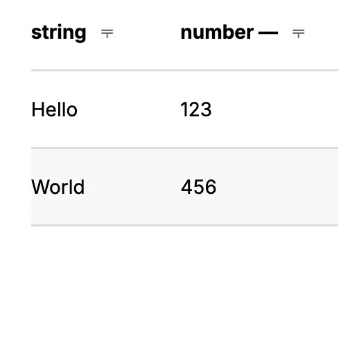

# PhoenixBetterTable

PhoenixBetterTable is a Phoenix Live Component that presents a filterable and sortable table component given table metadata and rows.

## Why?

It is designed to fill the space between `<table>` and fully featured data tables backed by Ecto, such as those in [flop_phoenix](https://hex.pm/packages/flop_phoenix).

## Features

- (optionally) sortable columns
- (optionally) filterable columns
- custom render functions for each column

## Usage

```elixir
<.live_component
    id="123"
    module={PhoenixBetterTable}
    rows={[%{text: "Hello", number: 123}, %{text: "World", number: 456}]}
    meta={%{headers: [%{id: :text, label: "string", sort: false}, %{id: :number}]}} />
```

produces a table with two columns ("Hello" and "World"), one sortable column ("World), and filtering by column contents:



### Custom render functions
Suppose you have a column with an action button you want to render. You can define a custom render function for that column:

```elixir
  def render_button(assigns) do
    ~H"""
      <button><%= @value %></button>
    """
  end
```

and pass it to the `meta` map:

```elixir
<.live_component 
  id="123" 
  module={PhoenixBetterTable} 
  rows={[%{action: "Hello", number: 123}, %{action: "World", number: 456}]} 
  meta={%{headers: [%{id: :action, label: "Action", sort: false, render: &render_button/1}, %{id: :number}]}} />
```

## Installation

The package can be installed by adding `phoenix_better_table` to your list of dependencies in `mix.exs`:

```elixir
def deps do
  [
    {:phoenix_better_table, "~> 0.4.0"}
  ]
end
```

The docs can be found at <https://hexdocs.pm/phoenix_better_table>.
